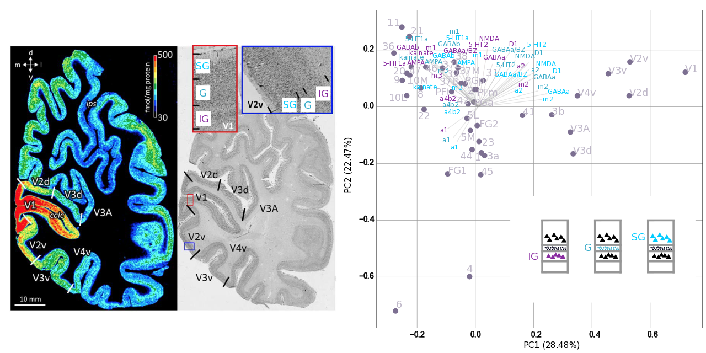

# Data mining of receptor autoradiography data with statistics and machine learning



# Description
The code performs a series of multivariate stats, dimensionaltiy reduction, machine learning (support vector regression) analysis, as well as feature selection (recursive feature elimination) to gain insights into the organization of 15 different types of receptors in the human brain. Each of these 15 receptors are measures in 3 layers of the cortex, that is, supgragranular (SG) ("upper"), granular (G) ("middle") and infragranular (IG) ("lower"). See left panel for an example for the visual regions of the human brain (V1 and V2v).

The right panel depicts PCA result of the receptor profiles of brain regions. This analysis reaveals the natural axis (PC1) of receptor distribution in the human brain (arrangement of brain regions) and the associated receptors that drive this segregation/arrangement along this natural axis (coefficients). The names of each rectors are color coded based on the layer that was used for the measurement. Thus, this PC space constitutes a compass for orienting ourselvels across the molecular landscape of the human brain.

Receptor density data are acquired via histological processing of human tissue (quantitative receptor autoradiography). An example of such datset is depicted in the figure (left panel) for the muscarinic M<sub>2</sub> transmitter receptor.

# Use
Create a virtual environment (e.g., with conda) with the specifications enlisted in requirements.txt. Download or clone this repository. If the virtual environment was created sucessfully, no further installations are required - the main.py file can be executed.

To do so, you have to specify the following folder and paths in the main.py file:
1. Folder to store the results (figures and tables). E.g., 
```
results_folder = Path("/Users/.../receptor-principles/results")
```
2. Folder to load the necessary data (.npy files in the recept_data folder of this repository). E.g.,
```
data_folder = Path("/Users/.../receptor-principles/data")
```

# Data

The receptor data are freely available from the following publication:

Zilles K, Palomero-Gallagher N (2018) Multiple transmitter receptors in regions and layers of the human cerebral cortex. Frontiers in Neuroanatomy 11:78 https://doi.org/10.3389/fnana.2017.00078

The cytology gradient data (G1_BigBrain.npy in the recept_data folder) are freely availble from the following puplication:

Paquola C, Vos De Wael R, Wagstyl K, Bethlehem RAI, Hong S-J, Seidlitz J, et al. (2019) Microstructural and functional gradients are increasingly dissociated in transmodal cortices. PLoS Biol 17(5): e3000284. https://doi.org/10.1371/journal.pbio.3000284


